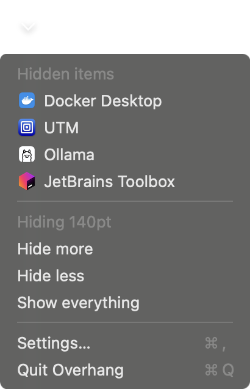
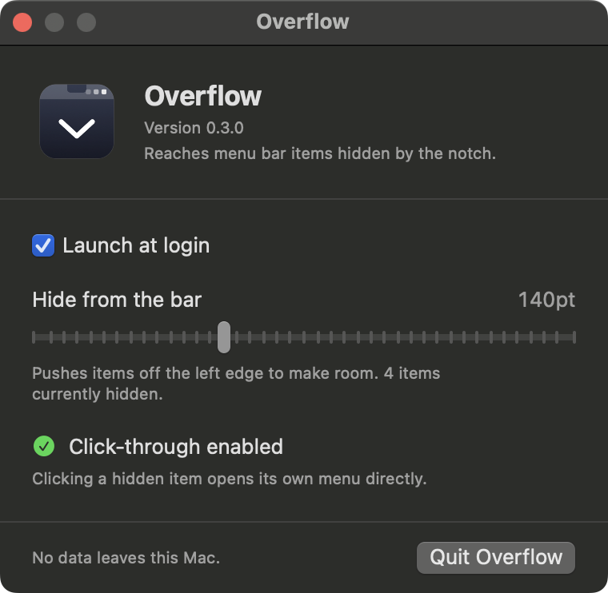

<div align="center">


# Overhang

**Reaches the menu bar items macOS hides behind the notch.**

[](https://github.com/nicglazkov/overhang/actions/workflows/ci.yml)
[](LICENSE)
[](https://www.apple.com/macos/)
[](#permissions)



</div>

---

## The problem

On a notched MacBook the menu bar is not as wide as it looks. The notch splits it in two, and
status items may only use the region to its right.

```
  0 ────────────── 790 ── NOTCH ── 1010 ─────────────────────── 1800
  └── app menus ──┘   └─ 220pt ─┘  └──── 790pt for status items ────┘
```

When that 790pt fills up, macOS does not warn you, shrink anything, or wrap to a second row.
It assigns the next item a slot and then **never draws it**.

That is not a theory. Measured on the machine this was built for, four items allocated slots
and none of them composited:

```
x= 851.0  w= 45.0  onscreen=N   Docker Desktop
x= 896.0  w= 32.0  onscreen=N   UTM
x= 928.0  w= 33.0  onscreen=N   Ollama
x=1001.0  w= 38.0  onscreen=N   JetBrains Toolbox   ← straddles the notch boundary at 1010
x=1111.0  w= 47.0  onscreen=Y   Stats               ← first one that fits
```

The item is gone. There is no overhang menu, no indicator, and no way to click it.

## What Overhang does

It puts a single chevron at the rightmost slot a third-party item can hold, and lists
everything macOS dropped, each with its owning app's icon.

Click an entry and its real menu opens.

<div align="center">

</div>

## Install

Download the latest `Overhang.zip` from [Releases](https://github.com/nicglazkov/overhang/releases),
unzip, and drag `Overhang.app` to `/Applications`.

The app is signed but **not notarized**, so the first launch needs a right-click → **Open**.

Or build it yourself:

```sh
git clone https://github.com/nicglazkov/overhang.git
cd overhang
make install
```

Requires [XcodeGen](https://github.com/yonaskolb/XcodeGen) (`brew install xcodegen`) and Xcode 15+.

## How it works

Three mechanisms, all verified on macOS 15.6 before being relied on.

**Finding what's hidden, no permission required.** Status items are windows at
`CGWindowLevelForKey(.statusWindow)` (layer 25). `CGWindowListCopyWindowInfo` reports each
one's owner PID, owner name, bounds, and on-screen flag. Window *titles* have been TCC-gated
since Catalina; none of these fields ever were. Querying with `.optionAll` rather than
`.optionOnScreenOnly` is what makes culled items discoverable at all, they remain in the
window list with valid geometry, they are simply never rasterized.

**Placing the chevron.** Writing `NSStatusItem Preferred Position` to `UserDefaults` before
creating the item lands it at the rightmost third-party slot. The value is measured from the
*right* edge, so a smaller number sorts further right. Control Center, the clock and Spotlight
are system-reserved and cannot be displaced by anything.

**Hiding.** An empty status item whose `length` grows shifts the whole third-party run leftward;
anything crossing the notch boundary is culled by WindowServer. Instant, reversible, and needs
no permission, hiding is a side effect of geometry.

That last one has a sharp edge. The shift applies to *every* third-party item including
Overhang's own chevron, so an oversized value deletes the app's only UI:

| spacer length | items on screen | chevron |
|---|---|---|
| 20 | 16 | visible |
| 120 | 13 | visible |
| 250 | 11 | visible |
| 400 | 7 | visible |
| 10000 | 2 | **lost** |

So the length is clamped against a live reading of the chevron's position, never a stored or
assumed one, the ceiling changes whenever any other app adds or removes an item.

## Permissions

**Overhang works with no permissions at all.** Finding, listing and hiding items need nothing.

Accessibility is **optional** and enables one thing: clicking an entry presses the real status
item so its own menu opens. Without it, clicking reveals the item in the bar for eight seconds
so you can click it by hand.

Overhang never requests Screen Recording. Other menu bar managers need it because they redraw
other apps' status-item images; Overhang draws the owning app's bundle icon instead.

Nothing is collected, and nothing leaves the machine.

## Settings

| Setting | What it does |
|---|---|
| Launch at login | Registers via `SMAppService`, no helper bundle |
| Hide from the bar | How much to push off the left edge, in points |
| Click-through | Accessibility opt-in, with live status |

## Limitations

Stated plainly, because they are real.

- **Click-through coverage is partial.** Items backed by an `NSMenu` respond to `AXPress`.
  Items that consume the mouse event themselves do not, a popover-based client ignored it even when fully
  visible, so this is architectural, not positional. Those fall back to reveal-and-click.
- **The spacer's width is a visible gap.** Hiding is done by displacement, so the space has to
  go somewhere. Avoiding this entirely would mean drawing our own bar, which is exactly what
  forces other tools into requiring Screen Recording.
- **Adding the chevron costs a slot.** On a full bar a ~30pt item evicts an existing one. That
  item becomes a casualty and so appears in the menu, still reachable, but the count of visible
  icons drops by one until the hide amount is tuned.
- **When the bar is completely full, the fallback surrenders the chevron.** There is no space to
  reveal into, so Overhang gives up its own width for eight seconds and restores it on a timer.
- **Not notarized.** First launch requires right-click → Open.

## Development

```sh
make          # build
make test     # run the test suite
make run      # build, install to /Applications, launch
make icon     # regenerate the icon from Tools/makeicon.swift
make release  # produce Overhang.zip
```

Ad-hoc signing is the default so the project builds for anyone. Accessibility grants are bound
to the code signature and ad-hoc rehashes every build, so if you are iterating and want the
grant to persist, use your own identity:

```sh
make install SIGN_ID="Apple Development: Your Name (XXXXXXXXXX)" TEAM_ID=YYYYYYYYYY
```

Tests are pure logic tests with no host app, covering the clamp arithmetic and casualty
classification, including the Control Center phantom-window case that motivated it.

Design notes and the record of what was measured live in
[`docs/design.md`](docs/design.md).

## License

MIT, see [LICENSE](LICENSE).
