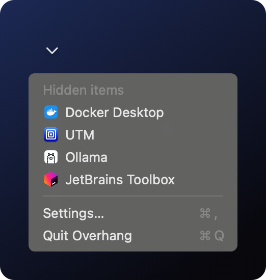
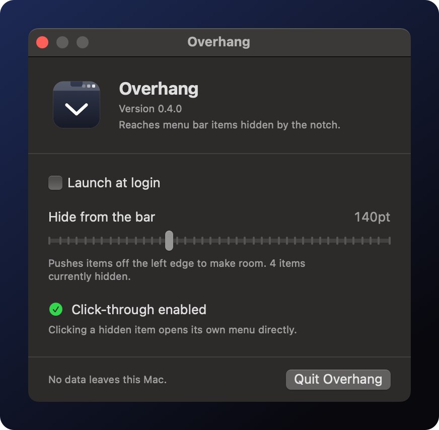

<div align="center">


# Overhang

**Nothing in your menu bar goes missing.**

[](https://github.com/nicglazkov/overhang/actions/workflows/ci.yml)
[](https://github.com/nicglazkov/overhang/releases/latest)
[](https://github.com/nicglazkov/overhang/releases)
[](https://nicglazkov.github.io/overhang/security.html)
[](https://nicglazkov.github.io/overhang/requirements.html)
[](LICENSE)

[**Website**](https://nicglazkov.github.io/overhang/) &nbsp;|&nbsp;
[**Download**](https://github.com/nicglazkov/overhang/releases/latest) &nbsp;|&nbsp;
[**FAQ**](https://nicglazkov.github.io/overhang/#faq) &nbsp;|&nbsp;
[**Privacy**](https://nicglazkov.github.io/overhang/privacy.html) &nbsp;|&nbsp;
[**Security**](https://nicglazkov.github.io/overhang/security.html)

</div>

<br>

When the menu bar fills up, macOS stops drawing icons. There is no warning and no overflow
control: the next icon is assigned a slot and simply never painted, which leaves it impossible
to click. On a notched MacBook the status area is only 790 points wide, so it happens sooner
than you would expect.

Overhang puts one chevron at the rightmost slot a third party item can hold and lists
everything macOS dropped. Click an entry and that item's own menu opens.

<br>

<div align="center">
&nbsp;&nbsp;

</div>

<br>

## Highlights

|   |   |
|---|---|
| 🔍 **Finds what is hidden** | Every dropped status item, each with the icon of the app that owns it |
| 🖱️ **Opens them normally** | One click and the item's own menu opens, as if it were still in the bar |
| 🔒 **Asks for nothing** | No permissions required. Screen Recording is never requested. No network, no analytics |
| ✅ **Notarized** | Signed with a Developer ID certificate, notarized by Apple, stapled. Double click and it runs |
| 🪶 **Tiny** | A single native binary under 2 MB. Universal, Apple silicon and Intel. Zero dependencies |

<br>

## Install

**Homebrew**

```sh
brew install --cask nicglazkov/tap/overhang
```

**Direct download**

Grab [`Overhang.dmg`](https://github.com/nicglazkov/overhang/releases/latest) and drag
Overhang to Applications. Signed and notarized by Apple, so it opens like any other app.

**Build from source**

```sh
brew install xcodegen
git clone https://github.com/nicglazkov/overhang.git
cd overhang
make install
```

<br>

## How it works

No Screen Recording, no private API, no accessibility requirement. Three mechanisms, each
verified by measurement before being relied on:

<details>
<summary><b>Finding hidden items needs no permission</b></summary>
<br>

Status items are windows at `CGWindowLevelForKey(.statusWindow)`, layer 25.
`CGWindowListCopyWindowInfo` reports each one's owner, bounds and on-screen flag; none of
those fields were ever TCC gated, only window titles were. Querying with `.optionAll` rather
than `.optionOnScreenOnly` is what makes culled items discoverable at all: they remain in the
window list with valid geometry, they are simply never rasterized.

</details>

<details>
<summary><b>Placement counts from the right edge</b></summary>
<br>

Writing `NSStatusItem Preferred Position` before creating the item lands the chevron at the
rightmost third party slot, beside Control Center. The value is measured from the right edge,
so a smaller number sorts further right. System items cannot be displaced by anything.

</details>

<details>
<summary><b>Hiding is a side effect of geometry</b></summary>
<br>

An empty status item whose length grows shifts the whole third party run leftward, and the
window server culls whatever crosses the notch boundary. Instant and reversible, because
nothing is intercepted. The shift applies to Overhang's own chevron too, so the length is
clamped against a live reading of the chevron's position; an unclamped value would push the
app's only control off screen:

| spacer length | items on screen | chevron |
|---|---|---|
| 20 | 16 | visible |
| 250 | 11 | visible |
| 400 | 7 | visible |
| 10000 | 2 | **lost** |

</details>

Accessibility is optional and enables exactly one thing: clicking an entry presses the real
status item so its own menu opens. Declined, Overhang reveals the item in the bar for eight
seconds so you can click it yourself. The relevant code is one short function,
[`Sources/Activator.swift`](Sources/Activator.swift).

<br>

## Development

```sh
make          # build
make test     # run the test suite, no host app needed
make run      # build, install to /Applications, launch
make dmg      # drag to install disk image
make verify   # codesign, Gatekeeper and staple checks
```

Requires Xcode 15+ and [XcodeGen](https://github.com/yonaskolb/XcodeGen). No dependencies,
Apple frameworks only. Ad hoc signing is the default so the project builds for anyone; see the
[Makefile](Makefile) for signing with your own identity, which keeps TCC grants across builds.

Design notes, including every measured finding this app is built on, live in
[`docs/design.md`](docs/design.md).

<br>

## Limitations

Stated plainly, because they are real.

- **Click-through coverage is partial.** Items backed by a standard menu open directly. Items
  that consume the mouse event themselves fall back to reveal and click. Architectural, not
  positional.
- **Hiding leaves a gap.** Displaced space has to go somewhere. Avoiding it entirely is what
  forces other tools into requiring Screen Recording.
- **The chevron costs a slot** on a completely full bar. The evicted icon appears in the menu,
  still reachable.

<br>

## License

[MIT](LICENSE)
